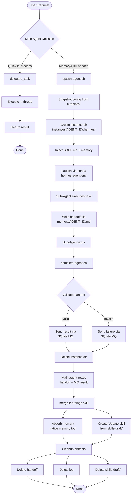
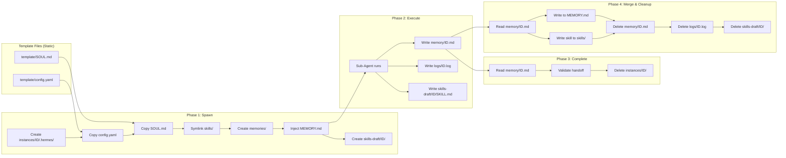
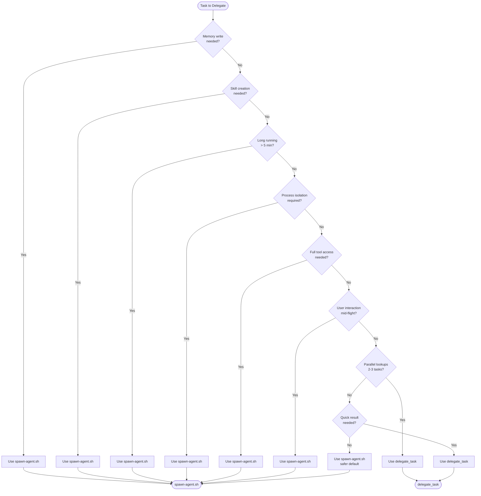

# Sub-Agent Lifecycle Documentation

This document provides comprehensive diagrams showing the full sub-agent lifecycle, from initial request through completion and cleanup.

---

## 1. High-Level Overview Flowchart

This flowchart shows the complete lifecycle at a glance, including the decision point between built-in `delegate_task` and custom `spawn-agent.sh` paths.



---

## 2. Detailed Sequence Diagram

This sequence diagram shows all actors and the message flow between them, including key data at each step.

```mermaid
sequenceDiagram
    actor User as User (Discord)
    participant Main as Main Agent<br/>(Hermes Gateway)
    participant Spawn as spawn-agent.sh
    participant Manager as Manager<br/>(registry)
    participant MQ as SQLite MQ
    participant Sub as Sub-Agent<br/>(Hermes CLI)
    participant Complete as complete-agent.sh
    participant Merge as merge-learnings<br/>(Skill)

    Note over User,Merge: Phase 1: Spawn
    
    User->>Main: Request task
    Main->>Main: Decision: delegate_task vs spawn-agent.sh
    
    alt spawn-agent.sh path selected
        Main->>Spawn: Execute: --role X --task "Y" --memory-file Z
        
        Note right of Spawn: Step 1: Generate AGENT_ID (uuid)
        Spawn->>Manager: allocate-port
        Manager-->>Spawn: PORT
        
        Note right of Spawn: Step 2: Create instance from template/
        Spawn->>Spawn: cp template/config.yaml → instances/ID/.hermes/
        Spawn->>Spawn: cp template/SOUL.md → instances/ID/.hermes/
        Spawn->>Spawn: ln -s ../skills → instances/ID/.hermes/skills
        
        Note right of Spawn: Step 3: Replace placeholders
        Spawn->>Spawn: Replace __PORT__, __API_KEY__, __MODEL__ in config.yaml
        Spawn->>Spawn: Replace __AGENT_ID__, __HANDOFF_PATH__, __SKILLS_DRAFT_PATH__ in SOUL.md
        Spawn->>Spawn: Append role & task to SOUL.md
        
        Note right of Spawn: Step 4: Create supporting dirs
        Spawn->>Spawn: mkdir instances/ID/.hermes/memories/
        Spawn->>Spawn: cp memory-file → instances/ID/.hermes/memories/MEMORY.md
        Spawn->>Spawn: mkdir skills-draft/ID/
        
        Note right of Spawn: Step 5: Send initial task via MQ
        Spawn->>MQ: send --from main --to ID --type task --content {role, task}
        
        Note right of Spawn: Step 6: Launch agent
        Spawn->>Sub: HERMES_HOME=instances/ID/.hermes conda run -n hermes-agent hermes chat ...
        Sub-->>Spawn: PID
        
        Spawn->>Manager: register --agent-id ID --role X --pid PID --port PORT --task "Y"
        Manager-->>Spawn: OK
        
        Spawn->>Spawn: Start completion watcher (wait PID → run complete-agent.sh)
        Spawn-->>Main: AGENT_ID, PID, PORT, MODE, LOG_FILE
    end

    Note over User,Merge: Phase 2: Execute & Monitor
    
    Sub->>MQ: receive --agent ID (get initial task)
    MQ-->>Sub: {role, task}
    
    loop Task Execution
        Sub->>Sub: Execute task using tools
        
        opt Progress updates
            Sub->>MQ: send --from ID --to main --type progress --content {percent, status}
            Main->>MQ: receive --agent main
            MQ-->>Main: progress message
            Main->>User: Report progress
        end
        
        opt Needs clarification
            Sub->>MQ: send --from ID --to main --type question --content {question}
            Main->>MQ: receive --agent main
            MQ-->>Main: question message
            Main->>User: Ask user
            User-->>Main: Answer
            Main->>MQ: send --from main --to ID --type task --content {answer}
            Sub->>MQ: receive --agent ID
            MQ-->>Sub: answer
        end
    end
    
    Note right of Sub: Task complete - write handoff
    Sub->>Sub: Write handoff to memory/ID.md
    Sub->>MQ: send --from ID --to main --type result --content {summary}
    Sub->>Sub: Exit process

    Note over User,Merge: Phase 3: Complete & Collect
    
    Complete->>Complete: Triggered by PID exit
    
    alt Handoff exists
        Complete->>Complete: Validate handoff sections
        Note right of Complete: Required: Task Summary,<br/>Process Log, Key Findings,<br/>Memory Updates, Skill Recommendation
        Complete->>Complete: Extract skill recommendation<br/>(NEW_SKILL / UPDATE_SKILL / NO_SKILL)
    else No handoff
        Complete->>Complete: validation = "missing_handoff"
    end
    
    Complete->>MQ: send --from ID --to main --type result --content {agent_id, validation, skill_rec, handoff_path, summary}
    Complete->>Manager: deregister --agent-id ID
    Manager-->>Complete: OK
    Complete->>Complete: rm -rf instances/ID/

    Main->>MQ: receive --agent main
    MQ-->>Main: result message
    
    Main->>Main: Read handoff file memory/ID.md
    
    alt validation == "complete"
        Main->>Merge: Invoke merge-learnings skill
        
        Merge->>Merge: Review Memory Updates section
        loop For each selected memory update
            Merge->>Main: memory(action=add/replace/remove, ...)
        end
        
        alt NEW_SKILL recommendation
            Merge->>Merge: Read skills-draft/ID/SKILL.md
            Merge->>Merge: Polish: add frontmatter, genericize
            Merge->>Merge: Write to $HERMES_HOME/skills/category/name/SKILL.md
        else UPDATE_SKILL recommendation
            Merge->>Merge: Read existing skill
            Merge->>Merge: Merge changes, bump version
            Merge->>Merge: Write updated skill
        end
        
        Merge->>Merge: Cleanup artifacts
        Merge->>Merge: rm -f memory/ID.md
        Merge->>Merge: rm -f logs/ID.log
        Merge->>Merge: rm -rf skills-draft/ID/
        
        Merge-->>Main: Complete
    else validation == "missing_handoff" or "incomplete"
        Main->>Main: Check logs/ID.log for errors
        Main->>Main: Manual cleanup if needed
    end
    
    Main->>User: Report completion & learnings summary
```



---

## 3. Data Flow Diagram

This diagram shows what files are created, read, and deleted at each stage of the lifecycle.



### File Lifecycle Table

| File/Directory | Created By | Read By | Deleted By | Purpose |
|----------------|------------|---------|------------|---------|
| `template/config.yaml` | Static | spawn-agent.sh | - | Base configuration template |
| `template/SOUL.md` | Static | spawn-agent.sh | - | Sub-agent persona template |
| `instances/ID/.hermes/` | spawn-agent.sh | Sub-Agent | complete-agent.sh | Full Hermes instance |
| `instances/ID/.hermes/config.yaml` | spawn-agent.sh | Sub-Agent | complete-agent.sh | Instance config (placeholders replaced) |
| `instances/ID/.hermes/SOUL.md` | spawn-agent.sh | Sub-Agent | complete-agent.sh | Instance persona (placeholders replaced) |
| `instances/ID/.hermes/memories/MEMORY.md` | spawn-agent.sh | Sub-Agent | complete-agent.sh | Injected context memory |
| `instances/ID/.hermes/skills/` (symlink) | spawn-agent.sh | Sub-Agent | complete-agent.sh | Access to main agent's skills |
| `memory/ID.md` | Sub-Agent | complete-agent.sh, merge-learnings | merge-learnings | Handoff file with task results |
| `logs/ID.log` | spawn-agent.sh | Main Agent (on error) | merge-learnings | Execution logs |
| `skills-draft/ID/SKILL.md` | Sub-Agent | merge-learnings | merge-learnings | Draft skill for NEW/UPDATE_SKILL |
| `registry.json` | Manager | Manager, spawn-agent.sh, complete-agent.sh | Manager | Agent registry (port, pid, status) |
| SQLite MQ | MQ script | All agents | Auto-expire | Inter-agent messaging |

---

## 4. Decision Tree: delegate_task vs spawn-agent.sh

This decision tree helps determine which delegation method to use based on task characteristics.



### Decision Criteria Summary

| Criteria | delegate_task | spawn-agent.sh |
|----------|---------------|----------------|
| **Best for** | Quick, focused, parallel lookups | Long-running tasks that should persist learnings |
| **Startup time** | ~0s (in-process thread) | ~5-10s (full Hermes instance) |
| **Memory write** | Blocked — subagents cannot update MEMORY.md | Full access — subagent has native memory tool |
| **Skill creation** | Not supported | Supported via handoff + merge-learnings |
| **Concurrency** | Up to 3 parallel (configurable) | Unlimited |
| **Process isolation** | None (same process) | Full OS process isolation |
| **Communication** | Synchronous return | Async via SQLite message queue |
| **Browser tool** | Works (uses main agent's browser) | Requires browser drivers |
| **Discord access** | Enabled | Disabled (headless) |

### Use `delegate_task` when:

- Task is short (< 5 minutes)
- No memory updates needed — results are consumed immediately
- Parallel execution of 2-3 independent lookups
- Examples: weather checks, web searches, code analysis, data formatting

### Use `spawn-agent.sh` when:

- Task produces knowledge that should be remembered (memory back-propagation)
- Task follows a procedure that could become a reusable skill
- Task needs full tool access (including execute_code, memory)
- Task is long-running or needs user interaction mid-flight
- Task needs full process isolation (security-sensitive)
- Examples: research projects, bug investigations, architecture design, workflow automation

---

## Key Paths Reference

```
$HERMES_HOME/sub-agents/
├── spawn-agent.sh          # Main spawn script
├── complete-agent.sh       # Completion handler
├── template/
│   ├── config.yaml         # Config template with __PLACEHOLDERS__
│   └── SOUL.md             # Persona template with __PLACEHOLDERS__
├── runtime/
│   ├── manager.py          # Registry management (port alloc, register/deregister)
│   └── mq.sh               # SQLite message queue interface
├── instances/              # Runtime instance directories (auto-deleted)
│   └── {uuid}/
│       └── .hermes/        # Full Hermes instance
├── memory/                 # Handoff files (deleted after merge)
│   └── {uuid}.md
├── logs/                   # Execution logs (deleted after merge)
│   └── {uuid}.log
├── skills-draft/           # Skill drafts (deleted after merge)
│   └── {uuid}/
│       └── SKILL.md
└── registry.json           # Agent registry (persistent)
```

---

## Message Types Reference

| Type | Direction | Purpose | Content Example |
|------|-----------|---------|-----------------|
| `task` | main → sub | Initial task assignment or mid-task instructions | `{"role": "researcher", "task": "..."}` |
| `progress` | sub → main | Status updates during long-running work | `{"percent": 40, "status": "Processing..."}` |
| `question` | sub → main | Needs user input or clarification | `{"question": "Which branch?"}` |
| `result` | sub → main | Final output of the task | `{"summary": "Refactored 3 files..."}` |
| `result` | complete → main | Completion notification | `{"agent_id": "...", "validation": "complete", ...}` |
| `error` | sub → main | Unrecoverable problem | `{"error": "Permission denied", ...}` |
| `control` | main → sub | Control signals (stop, pause) | `{"action": "stop"}` |

---

## Handoff File Structure

The handoff file (`memory/{agent-id}.md`) must contain these sections:

```markdown
# Sub-Agent Handoff: {agent-id}

## Task Summary
What was accomplished and the approach taken.

## Process Log
Step-by-step record of what the agent did.

## Key Findings
Important discoveries, decisions, results.

## Memory Updates
ACTION: add | CONTENT: "fact to remember"
ACTION: replace | OLD: "outdated" | CONTENT: "corrected"

## Skill Recommendation
NEW_SKILL: skill-name -- description
# or
UPDATE_SKILL: existing-skill -- description
# or
NO_SKILL
```
